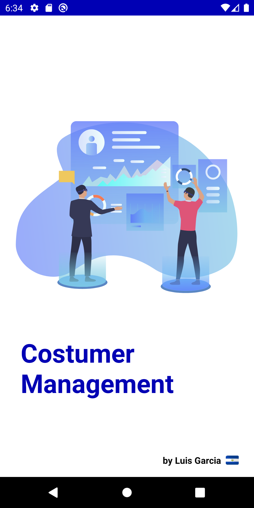
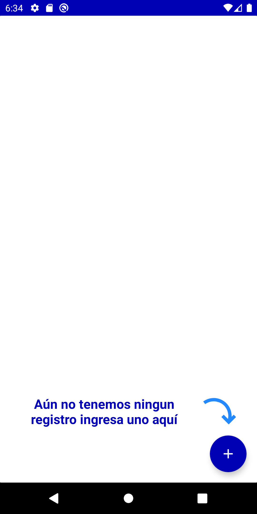
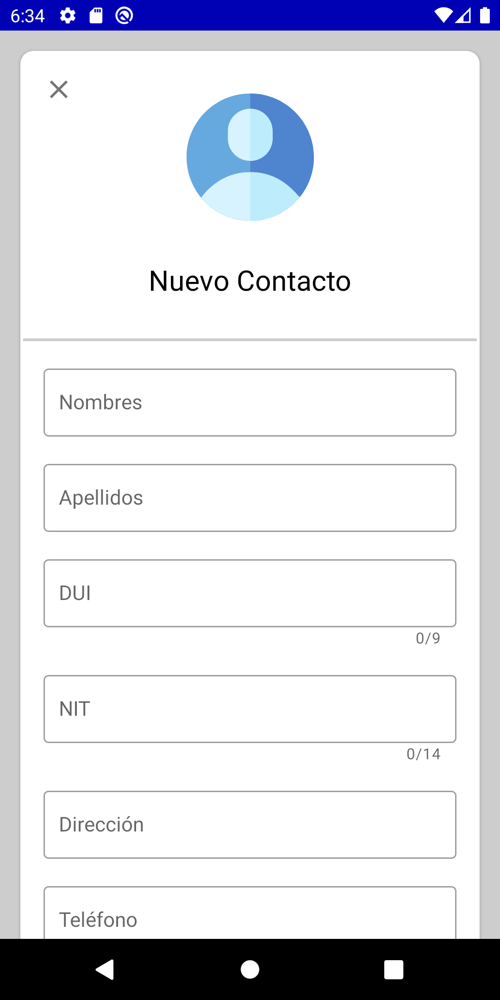
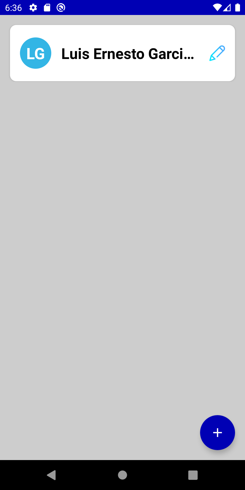
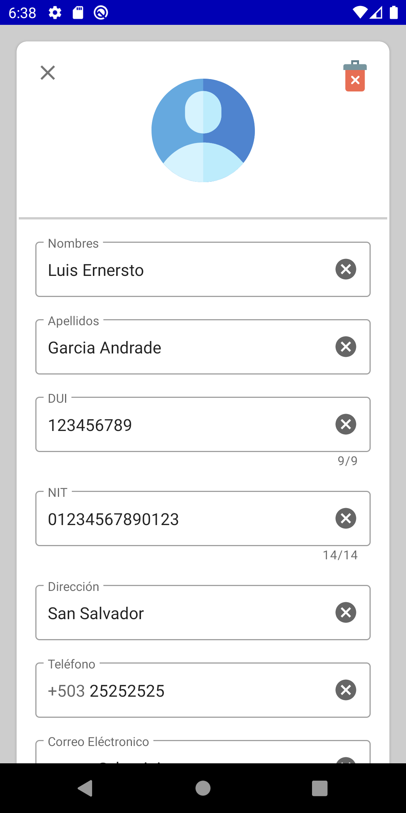
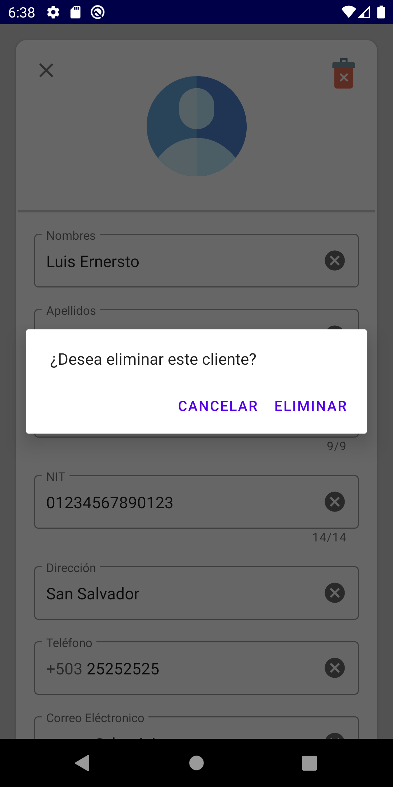

# Costumer Management

**Costumer Management** es una aplicación creada para la administración de sus clientes, teniendo de forma organizada y accesible cualquier consulta relacionada a ellos.

# Capturas de Pantalla

     

## Librerias usadas:

* **Arquitectura** - Para nuestra arquitectura de MVVM utilizamos una colección de bibliotecas que lo ayudan a diseñar aplicaciones robustas, comprobables y mantenibles. Comience con clases para administrar el ciclo de vida de su componente UI y manejar la persistencia de datos.
	* **LifeCycles** - Cree una interfaz de usuario que responda automáticamente a los eventos del ciclo de vida.
	* **LiveData** - Cree objetos de datos que notifiquen las vistas cuando cambie la base de datos subyacente.
	* **Navigation** - Maneja todo lo necesario para la navegación en la aplicación.
	* **ViewModel** - Almacenar datos relacionados con la interfaz de usuario que no se destruyen en las rotaciones de aplicaciones. Programe fácilmente tareas asincrónicas para una ejecución óptima.
* **UI** - Detalles de diseño
	* **Material Design** - Componentes de InputLayout para crear una mejor experiencia al usuario.
	* **Lottie** - Componente para animaciones vectoriales, se utilizó en el Splash Screen.
* **Persistencía**
	* **Sqlite** - para lograr la persistencia en está aplicación se utilizó la libreria nativa de sqlite de Android.
